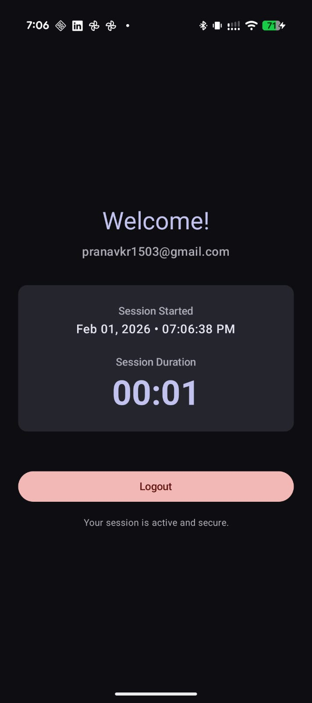

# OtpAuthCompose

A passwordless authentication demo app using Email + OTP (One-Time Password), built with Jetpack Compose.

## Screenshots

<p float="left">
  
  
  
</p>

## Features

- 📧 Email-based authentication
- 🔢 6-digit OTP generation and validation
- ⏱️ OTP expiry handling (60 seconds)
- 🔒 Attempt limiting (max 3 attempts)
- 📊 Session tracking with live duration timer
- 📝 Timber-based logging

## Architecture

This app follows modern Android development best practices:

- **UI Framework**: Jetpack Compose (100% declarative, no XML)
- **Architecture**: ViewModel + UI State (unidirectional data flow)
- **Async**: Kotlin Coroutines
- **Logging**: Timber

### Project Structure

```
app/src/main/java/com/example/otpauthcompose/
├── MainActivity.kt              # Entry point, navigation orchestration
├── OtpAuthApplication.kt        # Application class, Timber init
├── analytics/
│   └── AnalyticsLogger.kt       # Timber logging wrapper
├── data/
│   └── OtpManager.kt            # OTP generation, validation, storage
├── viewmodel/
│   ├── AuthState.kt             # Sealed UI states
│   └── AuthViewModel.kt         # Business logic, state management
└── ui/
    ├── LoginScreen.kt           # Email entry screen
    ├── OtpScreen.kt             # OTP entry screen
    ├── SessionScreen.kt         # Logged-in session screen
    └── theme/                   # Material 3 theming
```

## OTP Logic and Expiry Handling

### OTP Generation
- OTPs are 6-digit numeric codes (100000-999999)
- Generated using Kotlin's `random()` function
- Each email has its own OTP data stored in a `Map<String, OtpData>`

### OTP Validation Rules

| Rule | Behavior |
|------|----------|
| **Expiry** | OTP expires after 60 seconds |
| **Max Attempts** | 3 attempts allowed per OTP |
| **Resend** | Generates new OTP, resets timer and attempts |
| **Success** | Clears OTP data, starts session |

### Edge Cases Handled

1. **Expired OTP**: User is notified and prompted to resend
2. **Invalid OTP**: Attempt counter decrements, user notified of remaining attempts
3. **Max Attempts Exceeded**: OTP invalidated, must resend
4. **Screen Rotation**: State survives via ViewModel
5. **Timer Cancellation**: Properly cancelled on logout/navigation

## Data Structures

### OtpData
```kotlin
data class OtpData(
    val otp: String,           // The 6-digit OTP
    val generatedAt: Long,     // Timestamp (milliseconds)
    val attemptCount: Int = 0  // Failed validation attempts
)
```

**Why this structure?**
- Immutable data class for thread safety
- `generatedAt` allows calculating remaining time without additional state
- `attemptCount` tracks validation attempts per OTP

### OtpValidationResult
```kotlin
sealed class OtpValidationResult {
    data object Success : OtpValidationResult()
    data object Expired : OtpValidationResult()
    data class Invalid(val attemptsRemaining: Int) : OtpValidationResult()
    data object MaxAttemptsExceeded : OtpValidationResult()
    data object NoOtpFound : OtpValidationResult()
}
```

**Why sealed class?**
- Exhaustive `when` handling ensures all cases are covered
- Type-safe result handling
- Each result carries only relevant data

### AuthState
```kotlin
sealed class AuthState {
    data class EmailEntry(...) : AuthState()
    data class OtpEntry(...) : AuthState()
    data class LoggedIn(...) : AuthState()
    data class Error(...) : AuthState()
}
```

**Why sealed class for UI state?**
- Single source of truth for UI
- Impossible states are unrepresentable
- Clean separation between screens

### Storage: Map<String, OtpData>

```kotlin
private val otpStorage: MutableMap<String, OtpData> = mutableMapOf()
```

**Why Map?**
- O(1) lookup by email
- Natural key-value relationship (email → OTP data)
- Easy to extend for multiple concurrent OTPs
- Simple to test and reason about

## Why Timber?

[Timber](https://github.com/JakeWharton/timber) was chosen for logging because:

1. **Automatic Tag Generation**: Uses class name by default, reducing boilerplate
2. **Configurable Trees**: Different logging strategies for debug/release
3. **Crash-safe**: No crashes if forgetting to initialize
4. **Android Integration**: Designed specifically for Android
5. **Lightweight**: Minimal footprint
6. **Production-ready**: Widely used in industry

### Logged Events

| Event | Log Level | Description |
|-------|-----------|-------------|
| OTP Generated | INFO | When new OTP is created for an email |
| Validation Success | INFO | When OTP is successfully validated |
| Validation Failure | WARN | When validation fails (with reason) |
| Logout | INFO | When user logs out |

### Privacy

Emails are masked in logs for privacy:
- `user@example.com` → `u**r@example.com`

## Timer Implementation

### OTP Countdown Timer
```kotlin
private fun startOtpCountdown(email: String) {
    otpCountdownJob?.cancel()
    otpCountdownJob = viewModelScope.launch {
        var remainingSeconds = 60
        while (remainingSeconds > 0) {
            delay(1000L)
            remainingSeconds--
            // Update state...
        }
    }
}
```

**Key Points:**
- Uses `viewModelScope` for automatic cancellation
- `delay()` is cancellable (no blocking)
- Previous job cancelled before starting new one
- Properly stops on state change

### Session Timer
Similar implementation for tracking logged-in session duration.

## Setup Instructions

### Prerequisites

Before you begin, ensure you have the following installed:

| Requirement | Version | Notes |
|-------------|---------|-------|
| **Android Studio** | Ladybug (2024.2.1) or later | [Download](https://developer.android.com/studio) |
| **JDK** | 11+ | Bundled with Android Studio |
| **Android SDK** | API 36 (compile), API 24+ (min) | Install via SDK Manager |
| **Gradle** | 8.13+ | Managed by Gradle Wrapper |

### Installation

1. **Clone the repository**
   ```bash
   git clone https://github.com/pranav8431/OtpAuthCompose.git
   cd OtpAuthCompose
   ```

2. **Open in Android Studio**
   - Launch Android Studio
   - Select **File → Open**
   - Navigate to the cloned project folder and click **OK**

3. **Sync Gradle**
   - Android Studio will automatically prompt you to sync Gradle
   - If not, click **Sync Project with Gradle Files** in the toolbar
   - Wait for dependencies to download

4. **Configure an Emulator (Optional)**
   - Go to **Tools → Device Manager**
   - Click **Create Device**
   - Select a device (e.g., Pixel 6) and click **Next**
   - Choose a system image with API 24 or higher
   - Click **Finish**

### Building the Project

**From Android Studio:**
- Click **Build → Make Project** or press `Ctrl+F9` (Windows/Linux) / `Cmd+F9` (macOS)

**From Command Line:**
```bash
# Debug build
./gradlew assembleDebug

# Release build
./gradlew assembleRelease
```

The APK will be generated at:
- Debug: `app/build/outputs/apk/debug/app-debug.apk`
- Release: `app/build/outputs/apk/release/app-release.apk`

### Running the App

**From Android Studio:**
1. Select a target device (emulator or connected device) from the dropdown
2. Click the **Run** button (green play icon) or press `Shift+F10`

**From Command Line:**
```bash
# Install and run debug build on connected device
./gradlew installDebug

# Run using adb after building
adb install app/build/outputs/apk/debug/app-debug.apk
adb shell am start -n com.example.otpauthcompose/.MainActivity
```

### Running Tests

```bash
# Unit tests
./gradlew test

# Instrumented tests (requires device/emulator)
./gradlew connectedAndroidTest
```

### Troubleshooting

| Issue | Solution |
|-------|----------|
| Gradle sync fails | Ensure you're connected to the internet and using compatible Android Studio version |
| Emulator won't start | Enable hardware acceleration (HAXM/KVM) in BIOS |
| Build fails with JDK error | Ensure JDK 11+ is configured in **File → Project Structure → SDK Location** |
| "SDK not found" | Create `local.properties` file with `sdk.dir=/path/to/android/sdk` |

## AI-Assisted vs Manual Implementation

### AI-Assisted (GitHub Copilot)

The following were generated with AI assistance based on the `COPILOT_PROMPT.md` specification:

- Initial file structure and boilerplate
- Data class definitions
- ViewModel scaffolding
- Compose UI layouts
- Documentation comments
- README structure

### Manually Understood and Implemented

The developer needed to understand and verify:

1. **Architecture Decisions**: Why sealed classes? Why Map for storage?
2. **Coroutine Scoping**: Understanding `viewModelScope` lifecycle
3. **Compose State Management**: `remember` vs `rememberSaveable`, `collectAsState`
4. **Timer Cancellation**: Proper cleanup to avoid leaks
5. **Edge Cases**: What happens on rotation? On back press?
6. **Testing Strategy**: How to unit test OtpManager?

### Key Learning Points

- AI accelerates boilerplate but understanding is crucial
- Edge cases require human reasoning
- Architecture decisions need justification
- Code review of AI output is essential

## Dependencies

- Jetpack Compose (Material 3)
- Kotlin Coroutines
- AndroidX ViewModel
- Timber

## License

MIT License
